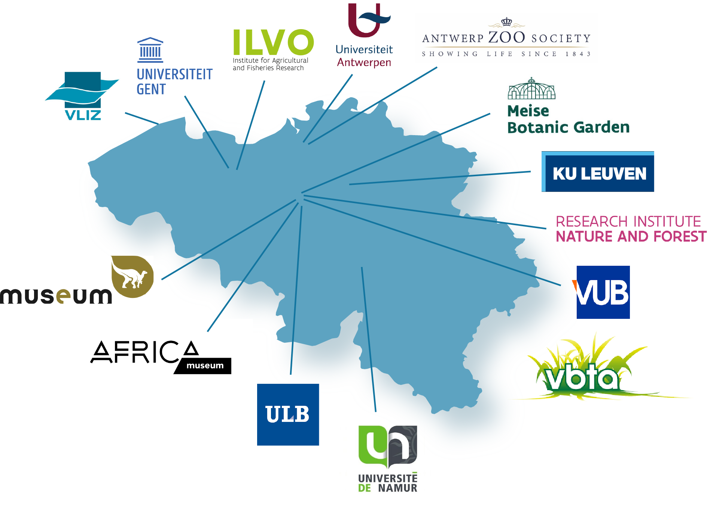
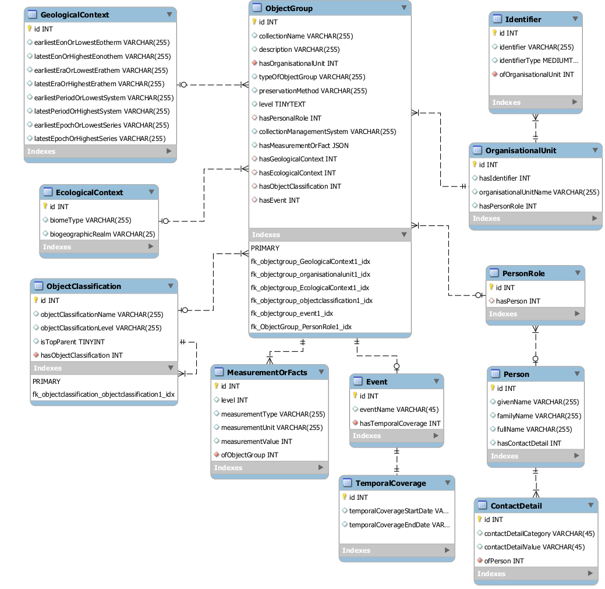
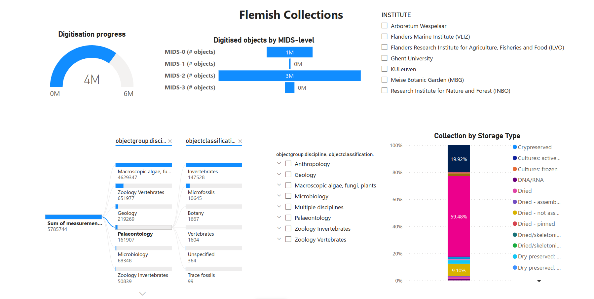

> **_NOTE:_**  This is a preprint version.

# Implementation Experience Report for the developing Latimer Core standard: the DiSSCo Flanders use-case

Lissa Breugelmans, Meise Botanic Garden, Belgium, https://orcid.org/0000-0002-8472-3577

Maarten Trekels, Meise Botanic Garden, Belgium, https://orcid.org/0000-0001-8282-8765

## Introduction and background

Natural science collections are a primary resource for mapping out the world’s biodiversity through the long-term preservation of collected specimens (Buschbom et al. 2022). Although significant efforts are ongoing in digitizing this important contribution to our knowledge, many collections are still not or far from being digitally available to science. In order to ensure that valuable collections are findable to the community there is a clear need for a standardized approach to describing the content of collections (Kirk et al. 2023).

To accomplish this goal, it is important to facilitate interoperability between major registries holding information on the collections and institutions (GRSciColl, Index Herbariorum, CETAF registry…). The development of the Latimer Core standard is aimed at increasing the FAIRness of data on collections (Woodburn et al. 2022).

*Figure 1: Overview of the DiSSCo Flanders consortium*

This implementation experience report is initiated from the DiSSCo Flanders use case. The DiSSCo Flanders project prepares the Flemish collections for the European DiSSCo research infrastructure (Trekels et al. 2022). DiSSCo Flanders will address biological, anthropological, and geological collections, comprising preserved, living, tissues, and molecular collections at the regional level. The consortium exists of the Flemish universities, research institutions, and an association of botanical gardens and arboreta. Associated to the project are the  Federal Belgian collections to ensure aligned policies and procedures (Figure 1).  The goal is to increase the digital visibility of the collections, ranging from the institutional level down to the specimen level. At the specimen level, the consortium makes digitized specimens available through GBIF as soon as possible. However, there was a clear need to be able to describe them at a higher organizational level.

## Development of the Latimer Core standard
Based on the earlier work of the Natural Collection Descriptions (NCD) group, the TDWG Collections Description Interest group developed the Latimer Core standard (Woodburn et al. 2022). Over a period of more than four years, weekly virtual meetings were held to develop the standard. On top of this, sessions and workshops were organized at relevant conferences in order to collect use cases for the standard.

In order to facilitate the development of the standard, the approach was taken to create a GitHub issue for each of the classes and terms within the standard. This allowed the group to track all discussions and changes that were taking place during the development. 

During the development phase, it was clear that already early on in the process a need existed to implement real-world examples using the standard. WIkibase was used as an experimental tool to describe collections using the current terms that were available in the standard (Trekels et al. 2020).

## Implementation in DiSSCo Flanders

As stated above, the DiSSCo Flanders project aims at obtaining high-level information on the Natural Science Collections held in the collection-holding institutions in Flanders that participate in the DiSSCo-Flanders project. This information consists of quantitative data on the overall size of the collections, as well as size by taxonomic groups, preservation types, stratigraphic age, geographic region, and level of digitization (Van Baelen et al. 2022). Based on previous work done in the SYNTHESYS+ project (Smith et al. 2019), a survey was designed to retrieve relevant information on the collections.
Although the survey design was loosely based on the developments happening at the TDWG Collections Descriptions Interest Group, the survey remained static over time while the development of the Latimer Core standard was going through major changes. In order to ensure the interoperability of the collected data a mapping exercise was performed of the data with the current terms and concepts of the standard.

The data was extracted from the original survey spreadsheets and pivoted into a vertical format using Microsoft Power Query. A data model for a MySQL database was developed (Figure 2), taking into account the hierarchical nature of the data and using LatimerCore terms for table names and attributes. The database was subsequently populated with the survey data and used as input for a [Microsoft PowerBi dashboard](https://app.powerbi.com/view?r=eyJrIjoiNTgyYmEyNWQtOGE2My00NWVkLTkyN2YtYzBjZDI4M2I2MDI1IiwidCI6ImQ4NjA5MTVlLWI4YmUtNGY3Yi04NmJlLWUxNzNjMTgyZWFhZiIsImMiOjl9), which features a graphical overview of the content and digitization level of the Flemish collections (Figure 3).

*Figure 2: Visualisation of the DiSSCo Flanders data model*

*Figure 3: The DiSSCo Flanders PowerBI dashboard*

### Survey format

Despite the survey being developed with the (preliminary) standard in mind, some characteristics of the design made data extraction, import in the SQL-database and analysis more time-consuming than needed. Data on the collections were gathered on two levels. Collections were subdivided based on their geographical origin and the following metrics were recorded: number of objects digitized, number of objects not digitized (documented), number of objects not digitized (not documented), and total number of objects. On a higher level, collections were grouped over all geographic origins and the same measurements were recorded, in addition to: number of objects with images, number of type specimens, and number of specimens per MIDS level (MIDS-0, MIDS-1, MIDS-2, MIDS-3). It would have been easier for analysis and visualization purposes and less error-prone if the total number of objects could be calculated from the other metrics instead of recorded as a separate metric, and if the metrics could be aggregated over the subcollections to yield the higher-level metrics (instead of recording them separately). In addition, there is no link between the specimen counts by stratigraphic period and the remainder of the data, leading to redundancy in the database.

### LatimerCore terms

In general, most of the data could be relatively easily mapped to the LatimerCore terms. The smallest distinct collection subdivisions for which we had recorded metrics were determined and entered as instances of the ObjectGroup table. Subsequently, institute, specimen counts, biogeographical origin and discipline and taxonomic group were split off in separate tables (respectively the OrganisationalUnit, MeasurementOrFact, EcologicalContext and ObjectClassification tables). Specimen counts by stratographic period were stored by entering additional instances of the ObjectGroup and MeasurementOrFact table, and their stratographic periods in the GeologicalContext table. Finally, additional instances of the ObjectGroup table for collection departments were linked with total specimen counts in the MeasurementOrFact table, curator information in the PersonRole and Person tables, and time period of specimen collection in the Event and TemperalCoverage tables.

While implementing the standard for the first time, it was unclear where to store the terrestrial-freshwater-marine origins of the specimens as well as the geographical concepts which were used to describe units smaller than continents but larger than countries or regions. In the meantime, however, an additional class EcologicalContext (properties biomeType and biogeographicRealm) has been added to address this gap.

Several terms seem to be defined to be specified as multi-value (JSON array) fields. However, for the purpose of building the PowerBI dashboard, we were not able to find a way to join tables on multi-value fields and extract the necessary data (PowerBI query’s are constructed through the GUI and use its own query language). Therefore, we introduced additional fields in the referenced tables in order to introduce a single value field that refers back to the parent table (eg. a new field ofObjectGroup in the MeasurementOrFact table to replace the hasMeasurementOrFact field in the ObjectGroup table). We are unsure if the decision to work with multi-value fields was made for specific reasons (performance-related or other), but allowing for the relationship field in the other table might increase flexibility.

For the temperalCoverage class, the Latimer Core documentation suggests to leave the property EndDate blank when the collecting period is still currently running. There is however no term defined to use when the period is unknown, which might lead to confusion.

Finally, it would be useful to define controlled vocabularies for the classes and properties that are newly defined for the Latimer Core standard, in order to further enhance interoperability of the data. For certain properties, the use of the controlled vocabulary might be recommendable but not mandatory, in order to allow for flexibility. 

## Conclusions

Natural science collections contain a huge amount of information on the past and present of biodiversity worldwide. Since digitization at the specimen level is far from being accomplished to date, it remains a challenge to find relevant specimens and valorize the importance of these collections. Especially the smaller collections often remain unknown and even risk neglect or even disappearance. The Latimer Core standard wants to provide an answer to make collections and collection data more discoverable and interoperable.

The DiSSCo Flanders use-case looked at the content of regional Flemish collections through a survey. The smaller research collections and living plant collections typically had only limited or no online representation of their content. Even a rough inventory of many collections was lacking. The standardized approach of conducting the survey made sure that the content of the collections can be compared to each other. This also made it possible to have a graphical representation of the collections through a PowerBI dashboard, which is instrumental in increasing the visibility of the collections for scientists and policy makers. 

Although the survey design proved to be sub-optimal with respect to the current version of the Latimer Core standard, in general, it was manageable to map the survey results to the data standard. For data fields where this was not possible, we discussed them within the TDWG Collection Description Interest Group, which led to the addition of the EcologicalContext class. 

From the exercise we performed in the DiSSCo Flanders use-case, three recommendations can be formulated. First, the sub-optimal design of the survey, shows that there is a clear need in creating guidance on performing this kind of exercise. Future surveys in other consortia and institutions could clearly benefit from having a design blueprint for the survey. Secondly, it is advisable to further develop controlled vocabularies for the newly adopted Classes and Properties in order to maximize the interoperability of the data. Finally, in order to make the data available on a worldwide scale, we recommend that the LatimerCore standard is implemented in the main collection registries. Moreover, making it easy for institutions to publish a Latimer Core record once, would reduce the redundancy for collections to fill out and modify their records in several places. 

## Acknowledgements
The work presented in this report was funded by the Research Foundation – Flanders (FWO) as part of the Flemish contribution to the DiSSCo Research Infrastructure under grant n° I001721N (DiSSCo Flanders project).

## References
Buschbom J, Acosta-Buenaño N, Chocho VE, Irazábal JR, Macklin J, Ojeda Cabrera LM, Plos A, Tancoff S, Teta P, Valle C, Freire-Fierro A (2022) Campaigning for a Global Collections Network: Improving the digital representation and visibility of natural science collections from Latin America and the Caribbean. Biodiversity Information Science and Standards 6: e91356. https://doi.org/10.3897/biss.6.91356 

Kirk R. Johnson Ian F. P. Owens, A global approach for natural history museum collections. Science 379, 1192-1194 (2023). https://doi.org/10.1126/science.adf6434 

Smith VS, Gorman K, Addink W, Arvanitidis C, Casino A, Dixey K, Dröge G, Groom Q, Haston EM, Hobern D, Knapp S, Koureas D, Livermore L, Seberg O (2019) SYNTHESYS+ Abridged Grant Proposal. Research Ideas and Outcomes 5: e46404. https://doi.org/10.3897/rio.5.e46404 

Trekels M, Woodburn M, Paul DL, Grant S, Webbink K, Jones J, Groom Q (2020) How do you Develop a Data Standard? Wikibase might be the Solution…. Biodiversity Information Science and Standards 4: e59211. https://doi.org/10.3897/biss.4.59211 

Trekels M, Beirinckx L, Claerhout T, Dugardin C, Leliaert F, Pereboom Z, Slos D, Van Baelen A, Vandepitte L, Veltjen E, Verstockt S, Mergen P (2022) DiSSCo Flanders: A regional natural science collections management infrastructure in an international context. Biodiversity Information Science and Standards 6: e94350. https://doi.org/10.3897/biss.6.94350 

Van Baelen, Ann, Poot, Nathalie, Beirinckx, Lise, Bogaerts, Ann, Bellefroid, Elke, Claerhout, Tim, De Smedt, Sofie, Dugardin, Chantal, Engledow, Henry, Leliaert, Frederik, Ossaer, Joke, Pereboom, Zjef, Semal, Patrick, Slos, Dieter, Smirnova, Larissa, Vandepitte, Leen, Veltjen, Emily, & Trekels, Maarten. (2022). DiSSCo-Flanders WP2 – task 2.1, Detailed inventory of the collections: Report (Version 1, May 2022). Zenodo. https://doi.org/10.5281/zenodo.6511351  

Woodburn M, Buschbom J, Droege G, Grant S, Groom Q, Jones J, Trekels M, Vincent S, Webbink K (2022) Latimer Core: A new data standard for collection descriptions. Biodiversity Information Science and Standards 6: e91159. https://doi.org/10.3897/biss.6.91159 

